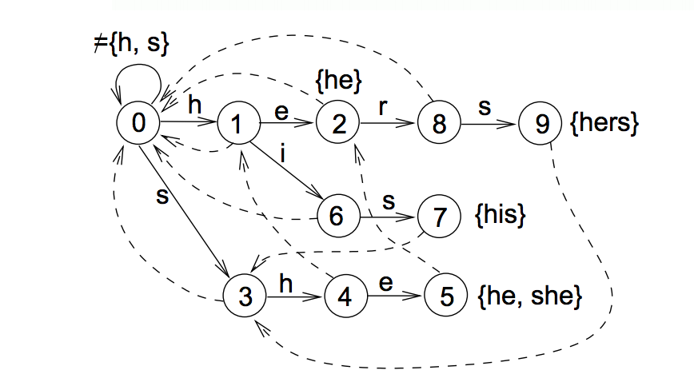

<script type="text/javascript" src="/js/vendor/jquery-1.11.0.min.js"></script>

<figure>
	</img>
</figure>

#Index Matching

Esse projeto foi desenvolvido como projeto da disciplina [IF767 - Processamento de Cadeia de Caracteres](http://www.cin.ufpe.br/~paguso/courses/if767/2015-2/). O relatório também está disponível [aqui](http://rafaelmarinheiro.github.io/projects/indexed_matching/pt_br/)

# Código

O códido será disponibilizado após o deadline.

# Objetivo

Esse projeto consiste da criação de uma ferramenta que permita ao usuário encontrar ocorrências fragmentos textuais (denominados por padrões ou agulhas) em arquivos de texto (denomidados por textos ou palheiros). A ferramenta em questão pode inicialmente pré-processar o palheiro, criando um índice. Esse índice pode ser então utilizado para encontrar rapidamente as ocorrências no texto indexado. 

No problema tratado, usualmente denota-se por $$n$$ o tamanho do texto e $$m$$ o tamanho do padrão, onde $$m < n$$. No entanto, é bastante comum que o tamanho do padrão seja muito menor que o tamanho do texto (agulha no palheiro). A nossa implementação foi pensada de modo a minimizar a utilização de memória e maximizar a performance das buscas justamente para o caso no qual $$m << n$$. Para tal, o arquivo de índice é estruturado num formato específico para minimizar o número e tamanho das leituras e maximizar o uso da localidade da informação.

# Implementação

## Go e Interfaces
Na nossa implementação, utilizamos a [linguagem de programação Go](https://golang.org/).

Go é uma linguagem de programação compilada, estaticamente e fortemente tipada, de paradigma imperativo. Resolvemos utilizá-la nesse projeto por 4 razões:

+ Facilidade de compilação e distribuição;
+ [Desempenho supostamente equivalente à linguagens compiladas](http://blog.golang.org/profiling-go-programs);
+ Recente adoção em sistemas em produção, a exemplo do [Docker](https://www.docker.com/) e [etcd](https://github.com/coreos/etcd);
+ Excelente conjunto de ferramentas associadas, em especial as ferramentes de Testes e [Profiling](http://blog.golang.org/profiling-go-programs).

Go também nos permite definir interfaces. Na nossa implementação, definimos a seguinte interface:


type Index interface {
	CountMatches(text string) (num_matches int)
	FindMatches(text string) (matches []int)
	ReadSubstring(begin int, out []byte) (size int)
	FindLine(byte_offset int) (line, begin, end int)
}


Essa interface nos dá todos os métodos necessários para construir a ferramenta que desejamos. Vale a pena ressaltar que é fácil programar uma implementação de uma estrutura ingênua que implemente a interface descrita (utilizando algoritmos $$O(m+n)$$ ou $$O(mn)$$, por exemplo). Isso foi bastante útil durante o processo de desenvolvimento pois nos permitiu criar testes unitários para garantir que a nossa implementação estava correta. É possível ver alguns dos testes unitários no arquivo ```suffixarray/naive_test.go```.

## Construção do Array de Sufixos

Na nossa implementação, nós utilizamos a estrutura de Array de Sufixos. Nós optamos pelo Array de Sufixos pois esta é uma estrutura relativamente compacta e e regular. Estas propriedades são úteis para tentar minimizar o uso de memória na nossa ferramenta. Além disso, sua regularidade nos permite explorar um pouco da localidade de cache da CPU, como será explicado posteriormente. É importante notar que a nossa implementação assume que o computador possui memória suficiente para conseguir armazenar o texto e o Array de Sufixos durante o processo de construção.

### SA-IS
Para construir o Array de Sufixos, nós utilizamos o algoritmo **SA-IS**: *Suffix Array Induced Sorting*. O SA-IS ordena as cadeias do Array de Sufixo levando em consideração as relações de ordem entre os sufixos consecutivos do array: Para cada sufixo da cadeia, rotule por **S** se ele for lexigraficamente menor que o sufixo que o sucede. Caso contrário, rotule-o por **L**. Nota-se que: 1) a cadeia original é composta por sequências de rótulo *SSSS...LLLL...* denomidadas por *LMS*, 2) a ordenação dos sufixos do texto pode ser derivada rapidamente da ordenação das cadeias *LMS*; O algoritmo explora essas propriedades para derivar um método linear para construção do Array de Sufixos.

A nossa implementação do SA-IS foi baseada na explicação disponível [aqui](http://zork.net/~st/jottings/sais.html). 

### Array LCP

Com o Array de Sufixos, é possível encontrarmos os locais das ocorrências do padrão realizando apenas uma busca binária. Se realizada sem estruturas adicionais, no entanto, a busca binária terá complexidade $$O(m \log n)$$. Com o auxílio de informações adicionais sobre a interseção dos sufixos, é possível realizar a busca binária com complexidade $$O(m + \log n)$$. Para obtermos essas informações, denominadas por LLCP (Left Longest Common Prefix) e RLCP (Right Longest Common Prefix), é inicialmente necessária construir o Array LCP, que guarda o tamanho do Maior Prefixo Comum entre entradas adjacentes do Array de Sufixo. Nós computamos o Array LCP em tempo linear utilizando o algoritmo descrito [aqui](http://web.cs.ucdavis.edu/~gusfield/cs224f11/lcp09.pdf).

Para computarmos os arrays LLCP e RLCP, nos utilizamos do fato que $$LCP(a, c) = \min(LCP(a, b), LCP(b, c))$$. É possível montar um algoritmo recursivo que calcula LLCP e RLCP em tempo linear.

## Armazenando o Índice

A nossa implementação do Array de Sufixos assume que o computador possua memória o suficiente para armazenar tudo em memória durante o processo de construção. Porém, durante o processo de consulta, gostaríamos que o computador utilizasse uma quantidade muito menor de recursos. Uma implementação que satisfaça esse requisito estará alinhada com o próprio padrão de uso do índice: gastar recursos num momento para construí-lo para depois fazer consultas eficientemente.

A descrição do projeto cita como requisito a utilização de algoritmos de compressão para reduzir o tamanho do índice. A maior parte dos algoritmos de compressão não permitem acesso aleatório eficiente aos dados comprimidos. Para acessar um determinado offset de um arquivo comprimido pelos algoritmos LZ77 é necessário decodificar todo o conteúdo até chegar neste offset. Embora existam algoritmos de compressão que permitam acesso aleatório, estes normalmente tem baixas taxas de compressão, o que não é o desejado. Pensando nessas limitações, elaboramos um formato de armazenamento de índice que permite utilizar algoritmos genéricos de compressão e ainda nos permite manter a baixa utilização de memória.

### Estrutura do Índice

A estrutura do índice deve ser pensada de modo a minimizar as leituras no disco nas operações mais comuns. Como estamos tentamos otimizar as operações de query, temos que compreender como funciona a consulta ao Array de Sufixos.

Consideremos que o índice é composto por duas partes principais: o texto ($$TXT$$) e o array de sufixos ($$SA$$). A consulta no nosso índice irá fazer uma busca binária nos elementos do array $$SA$$. Em cada etapa da busca binária, também faremos algumas consultas ao array $$TXT$$. Infelizmente, não podemos prever um padrão de acesso ao array $$TXT$$ pois os acessos dependem do conteúdo do array $$SA$$. Podemos, no entanto, prever um padrão de acesso ao array $$SA$$.

Sabemos que o intervalo de busca será reduzido à metade após cada etapa da busca binária. Suponha então que dividamos o array $$SA$$ em blocos de tamanho $$K$$. Suponha que queiramos descobrir qual desses blocos conterá o intervalo da busca binária após algumas etapas. Note que é possível utilizar uma outra busca binária para responder essa pergunta. Note também que é necessário consultar apenas alguns do elementos originais do array $$SA$$ para responder essa nova pergunta. Para ser mais preciso, ser escolhermos o tamanho $$K$$, precisaremos consultar apenas $$\frac{N}{K}$$ elementos do array original. No nosso caso, escolhemos $$K \approx \sqrt{N}$$.

Assim, durante a construção do nosso índice, nós separamos o array $$SA$$ em $$\sqrt{N}$$ blocos $$SABLOCK_{i}$$ de tamanho $$\sqrt{N}$$ e também armazenamos os $$\sqrt{N}$$ elementos separadores em um array $$SAIDX$$. Quando formos consultar o índice, teremos que carregar apenas o array $$SAIDX$$ e um dos blocos $$SABLOCK_i$$ na memória principal. É importante notar que cada bloco é comprimido de maneira independente. Isso permite acessar rapidamente as informações necessárias.

Apesar de não podermos prever o padrão de acesso ao array $$TXT$$, ainda é útil separá-lo em blocos $$TXTBLOCK_{i}$$. Desse modo não precisaremos manter todo o texto na memória durante a consulta. No nosso caso, escolhemos dividir o array $$TXT$$ em $$\sqrt{N}$$ blocos com $$\sqrt{N}$$ elementos. Assim como o blocos do array de sufixos, os blocos de texto são comprimidos de maneira independente.

Para podermos encontrar os blocos no arquivo, mantemos um header que guarda os offsets do blocos $$TXTBLOCK_{i}$$ e $$SABLOCK_{i}$$. Mantemos também alguns metadados no arquivo para especificar os métodos de compressão utilizados.

A estrutura final do arquivo de índice está descrita abaixo:



type SaEntry struct{
	idx varint
	llcp varint
	rlcp varint
}

type IndexFile struct{
	textLength varint
	compressionMethodNameLength varint
	compressionMethodName string
	uncompressedHeaderLength varint
	compressedHeaderLength varint
	metadata_size int32

	header struct{ //binary_Compressed
		blocksize varint
		
		numTextBlocks varint
		textBlockOffsets []varint

		numSABlocks varint
		saBlockOffsets []varint

		uncompressedSAIDXLength varint
		compressedSAIDXLength varint
	} 

	saidx []SaEntry //binary_Compressed

	txtblocks []struct{ //Each block is text_compressed
		text []byte
	} 
	sablocks []struct{ //Each block is binary_compressed
		sa []SaEntry
	} 

	num_lines varint
	lines_idx []varint //binary_Compressed

}


### Codificação Variável de Inteiros (varint)

O nosso arquivo de índice precisa guardar diversos números inteiros. Antes de aplicarmos algum método de compressão, nós codificamos os inteiros utilizando o método de codificação variável de inteiros, ou [varint](https://developers.google.com/protocol-buffers/docs/encoding#varints). Esse método de codificação é utilizado em algumas bibliotecas de serialização como Protobuf. A idéia desse método é marcar o bit mais significativo de um byte quando chegarmos no fim de um número. Assim, números menores $$2^{7k}$$ podem ser representados com $$k$$ bytes.

### Algoritmos de Compressão

Na nossa implementação, o método de compressão utilizado não tem restrições adicionais. O método não precisa suportar acesso aleatório, por exemplo. Nós implementamos dois métodos de Compressão: Reverser e LZ77.

O método Reverser apenas inverte o array a ser comprimido. Obviamente o resultado final tem exatamente o mesmo tamanho do array original, porém esse método tem algumas propriedades interessantes. Em particular, o método Reverser, ao contrário do método Identity não tolera off-by-one errors. Isso o torna útil durante o desenvolvimento, pois mostra que o código funcionaria com métodos genéricos de compressão.

O nosso LZ77 utiliza bytes como a menor unidade de compressão. Para escolhermos os parâmetros, consideramos que gostaríamos de utilizar no máximo 2 bytes por match. Definido isso, escolhemos arbitrariamente 5 bits para codificar o tamanho do match e 11 bits para codificar o offset do último match. Note que, com esses parâmetros, a codificação de uma cadeia é vantajosa apenas quando o tamanho do match é maior ou igual a 3. Nós utilizamos esse detalhe para melhorar a nossa codificação:

+ Caso um match de tamanho menor que 3 seja encontrado durante a compressão, nós o ignoramos e consideramos que nenhum match foi encontrado.
+ Nós temos 3 tipos de bytes:
	+ Tipo A: Byte contém 5 bits do tamanho do Match e 3 bits do offset do match
	+ Tipo B: Byte contém os outros 8 bits do offset do match
	+ Tipo C: Byte contém o caractere
+ Inicialmente, escrevemos um byte do tipo A. Caso o tamanho do match sera maior ou igual a 3, o próximo byte será um byte do tipo B seguido por um byte do tipo A. Caso o tamanho do match seja $$i$$ tal que $$0 \le i \le 2$$, os próximos $$i+1$$ bytes serão do tipo C, seguidos por um byte do tipo A.

Essa codificação tenta minimizar a penalização que ocorre quando não encontramos matches durante a compressão. Caso matches nunca sejam encontrados no texto, o tamanho final será no máximo $$\frac{4}{3}$$ do tamanho original do texto.

A nossa implementação permite utilizar métodos de compressão diferentes para o texto e para os campos binários. Evitamos utilizar o LZ77 para comprimir os campos binários pois estes tiverem baixas taxas de compressão. Isso é esperado considerando que o array de sufixo, por exemplo, é uma permutação. Portanto, este dificilmente apresentaria matches de tamanho maiores que 3, por exemplo.

## Algoritmos de Busca

A consulta ao índice é exige que apenas alguns items estejam na memória. No nosso caso, mantemos na memória apenas o header, o array $$SAIDX$$, alguns bloco $$SABLOCK{i}$$ e alguns blocos $$TXTBLOCK_{i}$$. Note que todos os items consomem $$O(\sqrt{n})$$ de memória, logo o programa precisa consumir apenas $$O(\sqrt{n})$$ para fazer uma consulta ao texto. Ou seja, com alguns poucos megabytes de RAM (2^20 bytes, por exemplo), conseguiríamos fazer consultas a arquivos com alguns terabytes de informação (2^40 bytes, por exemplo). 

### Caching

Apesar de, em tese, precisarmos manter apenas um bloco $$SABLOCK_{i}$$ e um bloco $$TXTBLOCK_{i}$$ na memória, na prática isso pode ser ineficiente. Por conta disso, mantemos um Cache com alguns blocos. Nós utilizamos a estratégia LRU (Least Recently Used) para escolher quais blocos ficam na memória. O usuário pode escolher o número máximo de blocos utilizando uma flag.

### Quebra de Linha

Para tratar as quebras de linha, guardamos um array com os índices dos ```\n```. Para encontrarmos a linha de um match, fazendo uma busca binária nesse array. Desse modo, encontramos o início e o fim das linhas do match. Desse modo, poderíamos facilmente mostrar imprimir toda a linha. Note, porém, que algum dos arquivos utilizados possuem linhas muito grandes. Por essa razão, nós imprimimos no máximo 80 caracteres antes e depois do match. Esse valor pode ser modificado utilizando uma flag.

## Micro-Otimizações
Todos os algoritmos são online, isto é, eles nunca precisam reutilizar alguma informação anterior do texto para executar. Apesar disso, alocamos um pequeno buffer para guardar parte do texto. Além disso, encapsulamos a leitura dos arquivos com objetos ```bufio.Reader``` com um buffer interno de 400KB. Fizemos isso numa tentativa de minimizar o overhead de múltiplas chamadas ao método ```Read```.  

Algumas otimizações foram utilizadas na implementação do Aho-Corasick e do algoritmo de Sellers. No Aho-Corasick inicialmente armazenávamos os filhos de um nó da trie dentro de um ```map[byte]int``` (estrutura nativa de Go). Porém, ao notarmos que os acessos ao map estavam relativamente lentos, trocamos essa estrutura de dados por um array com 255 posições ```[256]int```. 

No caso do Algoritmo de Sellers, inicialmente guardávamos as duas colunas em arrays separados. Após testes, resolvemos guardar as informações em um único array de forma alternada. Desse modo, precisávamos utilizar apenas uma pequena parte do array, otimizando o acesso à cache:


//Before////////////////////////
dist    [2][]int //Each slice has size n+1
distptr int

//Using
cur := distptr
old := 1-cur

dist[cur][i]
dist[old][i]


//After/////////////////////////
dist    []int //A slice with size 2*(n+1)
distptr int

//Using
cur := distptr
old := 1-cur

dist[2*i+cur]
dist[2*i+old]



# Testes

Testes foram executados com duas bases de dados do [Pizza&Chilli Protein](http://pizzachili.dcc.uchile.cl/texts/protein/). Os testes foram realizados em um MacBook Pro Retina de 13 polegadas, modelo Late 2013, com um processador Intel Core i5 de 2.4GHz, 8GB de memória RAM DDR3 a 1600MHz rodando o sistema operacional OS X El Capitan. Todos os tempos foram medidos utilizando o comando ```time``` O programa foi compilado utilizando a versão 1.5 do compilador de Go. 

Todos os experimentos foram feitos utilizando a flag ```-s```. Desse modo, a saída do algoritmo retorna apenas a lista dos matches, sem nenhuma informação adicional. O comando ```grep``` também é executado com a flag ```-o``` como controle

Os experimentos e resultados serão detalhados a seguir:

### Padrões

|  ID |                       Agulha                       |
| --- | :------------------------------------------------- |
|   1 | WHEY                                               |
|   2 | PASPRSSRGAGPVP                                     |
|   3 | PASPRSSRGAGPVPCAAPPQRAVLASPRSVRGGPKPPGRGGARASGGAAG |
|   4 | PASPRSSRGAGPVPCAAPPQRAVLASPRSVRGGPKPPGRGGARASGGAAA |
|   5 | RAFAEL                                             |
	
### Busca Exata - Um padrão

<div class="rfm-chart" id="chart_single_exact"></div>

| Comando | Agulha |     Palheiro    | Ocorrências | Tempo Médio* |
| ------- | ------ | --------------- | ----------: | -----------: |
| grep -o |      1 | proteins.50MB   |          19 |       0.978s |
| grep -o |      1 | proteins.100MB  |          33 |       1.962s |
| grep -o |      1 | proteins.200MB  |         113 |       3.997s |
| grep -o |      1 | proteins.1200MB |         424 |      23.922s |
| pmt -s  |      1 | proteins.50MB   |          19 |       0.431s |
| pmt -s  |      1 | proteins.100MB  |          33 |       0.856s |
| pmt -s  |      1 | proteins.200MB  |         113 |       1.736s |
| pmt -s  |      1 | proteins.1200MB |         424 |      10.227s |
| grep -o |      2 | proteins.50MB   |           2 |       1.374s |
| grep -o |      2 | proteins.100MB  |           2 |       2.832s |
| grep -o |      2 | proteins.200MB  |           2 |       5.283s |
| grep -o |      2 | proteins.1200MB |           3 |      32.138s |
| pmt -s  |      2 | proteins.50MB   |           2 |       0.465s |
| pmt -s  |      2 | proteins.100MB  |           2 |       0.947s |
| pmt -s  |      2 | proteins.200MB  |           2 |       1.835s |
| pmt -s  |      2 | proteins.1200MB |           3 |      10.367s |

### Busca Exata - Múltiplos Padrões

<div class="rfm-chart" id="chart_multiple_exact"></div>

|  Comando  |   Agulha   |     Palheiro    | Ocorrências | Tempo Médio* |
| --------- | ---------- | --------------- | ----------: | -----------: |
| pmt -s -p | 1, 2, 3, 4 | proteins.50MB   |          24 |       0.564s |
| pmt -s -p | 1, 2, 3, 4 | proteins.100MB  |          37 |       1.099s |
| pmt -s -p | 1, 2, 3, 4 | proteins.200MB  |         117 |       2.192s |
| pmt -s -p | 1, 2, 3, 4 | proteins.1200MB |         430 |      12.525s |
| pmt -s -p | 1, 5       | proteins.50MB   |          26 |       0.580s |
| pmt -s -p | 1, 5       | proteins.100MB  |          47 |       1.146s |
| pmt -s -p | 1, 5       | proteins.200MB  |         142 |       2.288s |
| pmt -s -p | 1, 5       | proteins.1200MB |         536 |      12.835s |

### Busca Aproximada - Um padrão

<div class="rfm-chart" id="chart_single_approximate"></div>

|  Comando  | Distância | Agulha |     Palheiro    | Ocorrências | Tempo Médio* |
| --------- | --------- | ------ | --------------- | ----------: | -----------: |
| pmt -s -e |         1 |      5 | proteins.50MB   |        1376 |       2.283s |
| pmt -s -p |         1 |      5 | proteins.100MB  |        2633 |       4.680s |
| pmt -s -p |         1 |      5 | proteins.200MB  |        4706 |       9.202s |
| pmt -s -p |         1 |      5 | proteins.1200MB |       23987 |      50.975s |
| pmt -s -p |         4 |      2 | proteins.50MB   |          20 |       5.252s |
| pmt -s -p |         4 |      2 | proteins.100MB  |          22 |      11.694s |
| pmt -s -p |         4 |      2 | proteins.200MB  |          24 |      23.127s |
| pmt -s -p |         4 |      2 | proteins.1200MB |          56 |      127.928 |

### Busca Aproximada - Múltiplos Padrões

A Busca Aproximada de Múltiplos padrões foi implementada simplesmente chamando várias vezes a Busca Aproximada de um único padrão. Logo, esperamos que o desempenho seja equivalente.

# Conclusões

Acreditamos que o resultado obtido foi satisfatório. Em todos os testes efetuados, a nossa implementação foi substancialmente mais rápida que a implementação do ```grep```. Além disso, o processo ```pmt``` nunca chegou a consumir mais que 400K de memória durante a sua execução, mostrando que ele de fato pode ser utilizado em palheiros arbitrariamente grandes com sucesso.

Poderíamos ter utilizado um algoritmo mais eficiente para realizar a busca aproximada. Posteriormente, implementaremos uma versão do algoritmo [Bitap](https://en.wikipedia.org/wiki/Bitap_algorithm).

<link rel="stylesheet" href="css/table.css">
<script type="text/javascript" src="https://www.google.com/jsapi"></script>

<script type="text/javascript">
	function drawGraphs(){
		drawExactSingle();
		drawExactMultiple();
		drawApproximateSingle();
	}

	function drawExactSingle(){
		var data = new google.visualization.DataTable();
		data.addColumn('number', 'Tamanho (MB)')
		data.addColumn('number', 'grep_agulha-1');
		data.addColumn('number', 'grep_agulha-2');
		data.addColumn('number', 'pmt_agulha-1');
		data.addColumn('number', 'pmt_agulha-2');

		data.addRows([
			[50,  0.978, 1.374, 0.431, 0.465],
			[100,  1.962, 2.832, 0.856, 0.947],
			[200,  3.997, 5.283, 1.736, 1.835],
			[1200,  23.922, 32.138, 10.227, 10.367],
			]);
		var options = {
				title: 'Busca Exata - Único padrão',
				subtitle: 'em segundos',
				 hAxis: {
          title: 'Tamanho (MB)'
        },
        vAxis: {
          title: 'Tempo (s)'
        },
	        // width: 900,
	        height: 500
	    };

	    var chart = new google.visualization.LineChart(document.getElementById('chart_single_exact'));

	    chart.draw(data, options);
	}

	function drawExactMultiple(){
		var data = new google.visualization.DataTable();
		data.addColumn('number', 'Tamanho (MB)')
		data.addColumn('number', 'pmt_agulha-1,2,3,4');
		data.addColumn('number', 'pmt_agulha-1,5');

		data.addRows([
			[50,  0.564, 0.580],
			[100,  1.099, 1.146],
			[200,  2.192, 2.288],
			[1200,  12.525, 12.835],
			]);
		var options = {
				title: 'Busca Exata - Múltiplos padrões',
				subtitle: 'em segundos',
	        // width: 900,
	        		 hAxis: {
          title: 'Tamanho (MB)'
        },
        vAxis: {
          title: 'Tempo (s)'
        },
	    
	        height: 500
	    };

	    var chart = new google.visualization.LineChart(document.getElementById('chart_multiple_exact'));

	    chart.draw(data, options);
	}

	function drawApproximateSingle(){
		$.getJSON("../data/varint.json", function(table){
			var data = new google.visualization.DataTable();
			data.addColumn('number', 'Número')
			data.addColumn('number', 'int32');
			data.addColumn('number', 'varint');
			data.addColumn('number', 'optimal');
			data.addRows(table);
			var options = {
					title: 'Busca Aproximada - Um padrão',
					subtitle: 'em segundos',
		        // width: 900,
		        		 hAxis: {
	          title: 'Tamanho (MB)'
	        },
	        vAxis: {
	          title: 'Tempo (s)'
	        },
		    
		        height: 500
		    };

		    var chart = new google.visualization.LineChart(document.getElementById('chart_single_approximate'));

		    chart.draw(data, options);
		}).fail(function( jqxhr, textStatus, error ) {
    var err = textStatus + ", " + error;
    console.log( "Request Failed: " + err );
});
	}

	google.load('visualization', '1.1', {packages: ['corechart', 'line']});
	google.setOnLoadCallback(drawGraphs);
</script>


