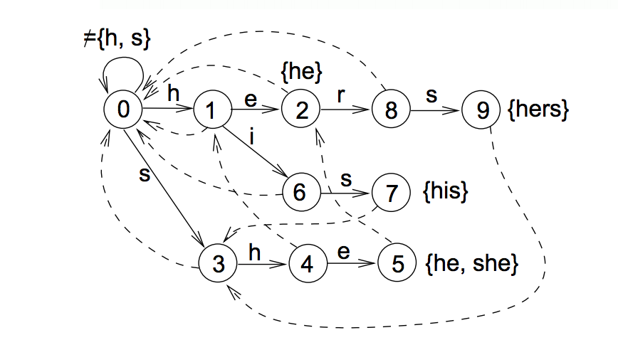

<figure>
	</img>
</figure>

#String Matching

Esse projeto foi desenvolvido como projeto da disciplina [IF767 - Processamento de Cadeia de Caracteres](http://www.cin.ufpe.br/~paguso/courses/if767/2015-2/). O relatório também está disponível [aqui](http://rafaelmarinheiro.github.io/projects/string_matching/pt_br/)

# Código

O códido será disponibilizado após o deadline.

# Objetivo

Esse projeto consiste da criação de uma ferramenta que permita ao usuário encontrar ocorrências fragmentos textuais (denominados por padrões ou agulhas) em arquivos de texto (denomidados por textos ou palheiros). A ferramenta em questão deve ter um funcionamento semelhante às ferramentas grep e agrep.

No problema em questão, usualmente denota-se por $$n$$ o tamanho do texto e $$m$$ o tamanho do padrão, onde $$m < n$$. No entanto, é bastante comum que o tamanho do padrão seja muito menor que o tamanho do texto (agulha no palheiro). A nossa implementação foi pensada de modo a minimizar a utilização de memória e maximizar a performance justamente para o caso no qual $$m << n$$.

# Implementação

## Go e Interfaces
Na nossa implementação, utilizamos a [linguagem de programação Go](https://golang.org/).

Go é uma linguagem de programação compilada, estaticamente e fortemente tipada, de paradigma imperativo. Resolvemos utilizá-la nesse projeto por 4 razões:

+ Facilidade de compilação e distribuição;
+ [Desempenho supostamente equivalente à linguagens compiladas](http://blog.golang.org/profiling-go-programs);
+ Recente adoção em sistemas em produção, a exemplo do [Docker](https://www.docker.com/) e [etcd](https://github.com/coreos/etcd);
+ Uso consistente de [Structural Typing](https://en.wikipedia.org/wiki/Structural_type_system), que é verificado em tempo de compilação.

O último ponto, por sua vez, estava alinhado com as necessidades do projeto. Como já citado, gostaríamos que a nossa ferramenta fosse otimizada para o caso $$m << n$$. Na nossa implementação, isso se traduz no seguinte: os padrões serão mantidos na memória principal do computador enquanto os textos deverão ser tratados com um stream. Isto é, apenas uma pequena parte do texto será mantida na memória principal. Podemos tratar um arquivo como um stream se assumirmos que um arquivo tem um método Read que recebe um ponteiro para um array de bytes e escreve parte do seu conteúdo nesse array. Isso é justamente o syscall [```read```](http://man7.org/linux/man-pages/man2/read.2.html) nos sistemas linux:


//Returns number of bytes written or an error code
ssize_t read(int fd, void *buf, size_t count);


Em Go, essa função se traduz como um método do objeto [```os.File```](https://golang.org/pkg/os/#File.Read)


//Returns number of bytes written and an error code
func (f *File) Read(b []byte) (n int, err error)


Porém, em Go esse conceito é generalizado. Assim como em Java ou C++, é possível criar uma interface que define um Reader deve fazer.


type Reader interface{
	//Returns number of bytes written and an error code
	Read(p []byte) (int, error)
}


Dois fatos tornam a implementação de interfaces interessante: As interfaces de Go seguem o princípio de [Duck Typing](https://en.wikipedia.org/wiki/Duck_typing): Se alguma classe possui todos os métodos de uma interface, então ela automaticamente implementa aquela interface. Isso simplifica e encoraja a adoção de interfaces dentro de um projeto. O que difere Go outras linguagens com Duck Typing é o fato dela ser estaticamente e fortemente tipada. Ou seja, todos os usos de interface serão validados em tempo de compilação, garantindo a corretude do programa.

O uso de interfaces é bastante consistente tanto na biblioteca padrão da linguagem quanto nas bibliotecas de terceiros. No nosso caso estamos interessados na interface [```io.Reader```](https://golang.org/pkg/io/#Reader). Temos vários exemplos de implementação de io.Reader:

+ [```os.File```](https://golang.org/pkg/os/#File.Read): Stream de bytes de um arquivo;
+ [```net.Conn```](https://golang.org/pkg/net/#Conn): Stream de bytes de um socket;
+ [```compress/gzip.Reader```](https://golang.org/pkg/compress/gzip/#Reader.Read): Stream de bytes resultados da descompressão do formato gzip
+ [```bufio.Reader```](https://golang.org/pkg/bufio/#Reader.Read): Reader que encapsula um outro reader para bufferizar chamadas seguidas ao método Read

No nosso projeto, fazemos uso extensivo de Readers. Em particular, os algoritmos codificados implementam a interface Matcher:


type Resetter interface {
	Reset()
}

type Matcher interface {
	//Resets the Matcher
	Resetter

	//Finds next match and return the byte offset of the end of the match
	//May return an error as well
	FindMatch(reader io.Reader) (offset int, err error)
}

type MultiMatcher interface {
	Resetter
	FindMultipleMatches(reader io.Reader) (int, []int, error)
}


Um ```Matcher``` deve retornar o offset, em número de bytes, do caractere que encerra uma ocorrência (utilizamos isso para termos resultados consistentes entre o matching exato e o matching aproximado). Um ```MultiMatcher``` tem um comportamento semelhante, mas pode retornar várias ocorrências para um mesmo offset (Note que é possível transformar um ```MultiMatcher``` num ```Matcher``` e vice-versa. Porém, isso ainda não foi implementado.)

## LineReader

Para podermos interpretar as quebras de linha num texto, implementamos a classe LineReader:


type LineReader struct {
	Reader   io.Reader
	// other unexported fields
}

//Creates a Line Reader
func NewLineReader(reader io.Reader) *LineReader

//Returns the number of bytes read so far
func (lr *LineReader) BytesRead()

//Returns EOL (End Of Line) error when 
//a EOL is found
func (lr *LineReader) Read(p []byte) (int, error)


O LineReader encapsula um outro Reader e retorna um erro EOL (End of Line) quando uma quebra de linha for detectada.

## Algoritmos de Busca

Para realizar a busca exata, utilizamos o algoritmo [Knuth-Morris-Pratt](https://en.wikipedia.org/wiki/Knuth%E2%80%93Morris%E2%80%93Pratt_algorithm) ou KMP e também o [Aho-Corasick](https://en.wikipedia.org/wiki/Aho%E2%80%93Corasick_algorithm). O KMP tem complexidade $$O(n+m)$$ para busca de um único padrão e o Aho-Corasick tem complexidade $$O(n+m'+k)$$ para busca de múltiplos padrões (onde $$m'$$ é a soma dos tamanhos dos padrões e $$k$$ é o número de ocorrências dos padrões no texto). O KMP é utilizado quando estamos buscando um único padrão e o Aho-Corasick é utilizado quando estamos buscando por múltiplos padrões.

Para realizar a busca aproximada, utilizamos o algoritmo de [Sellers](https://en.wikipedia.org/wiki/Approximate_string_matching). O algoritmo de Sellers tem complexidade $$O(mn)$$ para busca de um único padrão e complexidade $$O(m'n)$$ para busca de vários padrões (onde $$m'$$ é a soma dos tamanhos dos padrões). 

Todos os algoritmos foram implementados como classes que implementam a interface Matcher (MultiMatcher, no caso do Aho-Corasick). Os objetos tem que guardar alguma informação sobre o estado para garantir que múltiplas chamadas ao método FindMatch tenham um resultado consistente. Note, porém, que essas classes interpretam a entrada apenas como um stream contínuo de bytes, ignorando o comportamento de quebras de linha e etc. Portanto, o tratamento de tais comportamentos deve ser obrigação dos usuários das classes (na nossa implementação, a ferramenta pmt é usuária dessas classes). 

## Otimizações

Todos os algoritmos são online, isto é, eles nunca precisam reutilizar alguma informação anterior do texto para executar. Apesar disso, alocamos um pequeno buffer para guardar parte do texto. Além disso, encapsulamos a leitura dos arquivos com objetos ```bufio.Reader``` com um buffer interno de 400KB. Fizemos isso numa tentativa de minimizar o overhead de múltiplas chamadas ao método ```Read```.  

Algumas otimizações foram utilizadas na implementação do Aho-Corasick e do algoritmo de Sellers. No Aho-Corasick inicialmente armazenávamos os filhos de um nó da trie dentro de um ```map[byte]int``` (estrutura nativa de Go). Porém, ao notarmos que os acessos ao map estavam relativamente lentos, trocamos essa estrutura de dados por um array com 255 posições ```[256]int```. 

No caso do Algoritmo de Sellers, inicialmente guardávamos as duas colunas em arrays separados. Após testes, resolvemos guardar as informações em um único array de forma alternada. Desse modo, precisávamos utilizar apenas uma pequena parte do array, otimizando o acesso à cache:


//Before////////////////////////
dist    [2][]int //Each slice has size n+1
distptr int

//Using
cur := distptr
old := 1-cur

dist[cur][i]
dist[old][i]


//After/////////////////////////
dist    []int //A slice with size 2*(n+1)
distptr int

//Using
cur := distptr
old := 1-cur

dist[2*i+cur]
dist[2*i+old]



# Testes

Testes foram executados com duas bases de dados do [Pizza&Chilli Protein](http://pizzachili.dcc.uchile.cl/texts/protein/). Os testes foram realizados em um MacBook Pro Retina de 13 polegadas, modelo Late 2013, com um processador Intel Core i5 de 2.4GHz, 8GB de memória RAM DDR3 a 1600MHz rodando o sistema operacional OS X El Capitan. Todos os tempos foram medidos utilizando o comando ```time``` O programa foi compilado utilizando a versão 1.5 do compilador de Go. 

Todos os experimentos foram feitos utilizando a flag ```-s```. Desse modo, a saída do algoritmo retorna apenas a lista dos matches, sem nenhuma informação adicional. O comando ```grep``` também é executado com a flag ```-o``` como controle

Os experimentos e resultados serão detalhados a seguir:

### Padrões

|  ID |                       Agulha                       |
| --- | :------------------------------------------------- |
|   1 | WHEY                                               |
|   2 | PASPRSSRGAGPVP                                     |
|   3 | PASPRSSRGAGPVPCAAPPQRAVLASPRSVRGGPKPPGRGGARASGGAAG |
|   4 | PASPRSSRGAGPVPCAAPPQRAVLASPRSVRGGPKPPGRGGARASGGAAA |
|   5 | RAFAEL                                             |
	
### Busca Exata - Um padrão

<div class="rfm-chart" id="chart_single_exact"></div>

| Comando | Agulha |     Palheiro    | Ocorrências | Tempo Médio* |
| ------- | ------ | --------------- | ----------: | -----------: |
| grep -o |      1 | proteins.50MB   |          19 |       0.978s |
| grep -o |      1 | proteins.100MB  |          33 |       1.962s |
| grep -o |      1 | proteins.200MB  |         113 |       3.997s |
| grep -o |      1 | proteins.1200MB |         424 |      23.922s |
| pmt -s  |      1 | proteins.50MB   |          19 |       0.431s |
| pmt -s  |      1 | proteins.100MB  |          33 |       0.856s |
| pmt -s  |      1 | proteins.200MB  |         113 |       1.736s |
| pmt -s  |      1 | proteins.1200MB |         424 |      10.227s |
| grep -o |      2 | proteins.50MB   |           2 |       1.374s |
| grep -o |      2 | proteins.100MB  |           2 |       2.832s |
| grep -o |      2 | proteins.200MB  |           2 |       5.283s |
| grep -o |      2 | proteins.1200MB |           3 |      32.138s |
| pmt -s  |      2 | proteins.50MB   |           2 |       0.465s |
| pmt -s  |      2 | proteins.100MB  |           2 |       0.947s |
| pmt -s  |      2 | proteins.200MB  |           2 |       1.835s |
| pmt -s  |      2 | proteins.1200MB |           3 |      10.367s |

### Busca Exata - Múltiplos Padrões

<div class="rfm-chart" id="chart_multiple_exact"></div>

|  Comando  |   Agulha   |     Palheiro    | Ocorrências | Tempo Médio* |
| --------- | ---------- | --------------- | ----------: | -----------: |
| pmt -s -p | 1, 2, 3, 4 | proteins.50MB   |          24 |       0.564s |
| pmt -s -p | 1, 2, 3, 4 | proteins.100MB  |          37 |       1.099s |
| pmt -s -p | 1, 2, 3, 4 | proteins.200MB  |         117 |       2.192s |
| pmt -s -p | 1, 2, 3, 4 | proteins.1200MB |         430 |      12.525s |
| pmt -s -p | 1, 5       | proteins.50MB   |          26 |       0.580s |
| pmt -s -p | 1, 5       | proteins.100MB  |          47 |       1.146s |
| pmt -s -p | 1, 5       | proteins.200MB  |         142 |       2.288s |
| pmt -s -p | 1, 5       | proteins.1200MB |         536 |      12.835s |

### Busca Aproximada - Um padrão

<div class="rfm-chart" id="chart_single_approximate"></div>

|  Comando  | Distância | Agulha |     Palheiro    | Ocorrências | Tempo Médio* |
| --------- | --------- | ------ | --------------- | ----------: | -----------: |
| pmt -s -e |         1 |      5 | proteins.50MB   |        1376 |       2.283s |
| pmt -s -p |         1 |      5 | proteins.100MB  |        2633 |       4.680s |
| pmt -s -p |         1 |      5 | proteins.200MB  |        4706 |       9.202s |
| pmt -s -p |         1 |      5 | proteins.1200MB |       23987 |      50.975s |
| pmt -s -p |         4 |      2 | proteins.50MB   |          20 |       5.252s |
| pmt -s -p |         4 |      2 | proteins.100MB  |          22 |      11.694s |
| pmt -s -p |         4 |      2 | proteins.200MB  |          24 |      23.127s |
| pmt -s -p |         4 |      2 | proteins.1200MB |          56 |      127.928 |

### Busca Aproximada - Múltiplos Padrões

A Busca Aproximada de Múltiplos padrões foi implementada simplesmente chamando várias vezes a Busca Aproximada de um único padrão. Logo, esperamos que o desempenho seja equivalente.

# Conclusões

Acreditamos que o resultado obtido foi satisfatório. Em todos os testes efetuados, a nossa implementação foi substancialmente mais rápida que a implementação do ```grep```. Além disso, o processo ```pmt``` nunca chegou a consumir mais que 400K de memória durante a sua execução, mostrando que ele de fato pode ser utilizado em palheiros arbitrariamente grandes com sucesso.

Poderíamos ter utilizado um algoritmo mais eficiente para realizar a busca aproximada. Posteriormente, implementaremos uma versão do algoritmo [Bitap](https://en.wikipedia.org/wiki/Bitap_algorithm).

<link rel="stylesheet" href="css/table.css">
<script type="text/javascript" src="https://www.google.com/jsapi"></script>

<script type="text/javascript">
	function drawGraphs(){
		drawExactSingle();
		drawExactMultiple();
		drawApproximateSingle();
	}

	function drawExactSingle(){
		var data = new google.visualization.DataTable();
		data.addColumn('number', 'Tamanho (MB)')
		data.addColumn('number', 'grep_agulha-1');
		data.addColumn('number', 'grep_agulha-2');
		data.addColumn('number', 'pmt_agulha-1');
		data.addColumn('number', 'pmt_agulha-2');

		data.addRows([
			[50,  0.978, 1.374, 0.431, 0.465],
			[100,  1.962, 2.832, 0.856, 0.947],
			[200,  3.997, 5.283, 1.736, 1.835],
			[1200,  23.922, 32.138, 10.227, 10.367],
			]);
		var options = {
				title: 'Busca Exata - Único padrão',
				subtitle: 'em segundos',
				 hAxis: {
          title: 'Tamanho (MB)'
        },
        vAxis: {
          title: 'Tempo (s)'
        },
	        // width: 900,
	        height: 500
	    };

	    var chart = new google.visualization.LineChart(document.getElementById('chart_single_exact'));

	    chart.draw(data, options);
	}

	function drawExactMultiple(){
		var data = new google.visualization.DataTable();
		data.addColumn('number', 'Tamanho (MB)')
		data.addColumn('number', 'pmt_agulha-1,2,3,4');
		data.addColumn('number', 'pmt_agulha-1,5');

		data.addRows([
			[50,  0.564, 0.580],
			[100,  1.099, 1.146],
			[200,  2.192, 2.288],
			[1200,  12.525, 12.835],
			]);
		var options = {
				title: 'Busca Exata - Múltiplos padrões',
				subtitle: 'em segundos',
	        // width: 900,
	        		 hAxis: {
          title: 'Tamanho (MB)'
        },
        vAxis: {
          title: 'Tempo (s)'
        },
	    
	        height: 500
	    };

	    var chart = new google.visualization.LineChart(document.getElementById('chart_multiple_exact'));

	    chart.draw(data, options);
	}

	function drawApproximateSingle(){
		var data = new google.visualization.DataTable();
		data.addColumn('number', 'Tamanho (MB)')
		data.addColumn('number', 'pmt_agulha-1,2,3,4');
		data.addColumn('number', 'pmt_agulha-1,5');

		data.addRows([
			[50,  2.283, 5.252],
			[100,  4.680, 11.694],
			[200,  9.202, 23.127],
			[1200,  50.975, 127.928],
			]);
		var options = {
				title: 'Busca Aproximada - Um padrão',
				subtitle: 'em segundos',
	        // width: 900,
	        		 hAxis: {
          title: 'Tamanho (MB)'
        },
        vAxis: {
          title: 'Tempo (s)'
        },
	    
	        height: 500
	    };

	    var chart = new google.visualization.LineChart(document.getElementById('chart_single_approximate'));

	    chart.draw(data, options);
	}

	google.load('visualization', '1.1', {packages: ['corechart', 'line']});
	google.setOnLoadCallback(drawGraphs);
</script>


